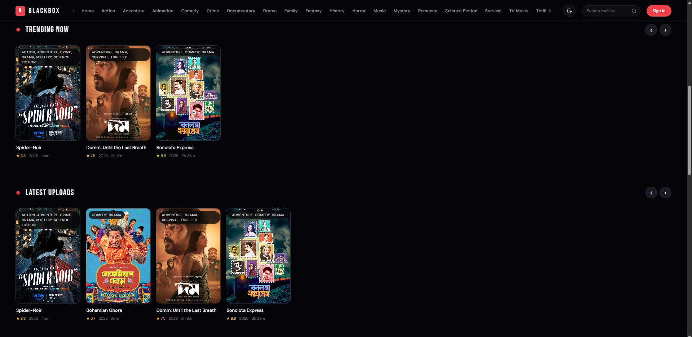
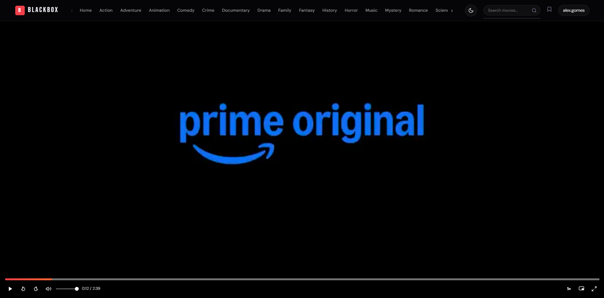
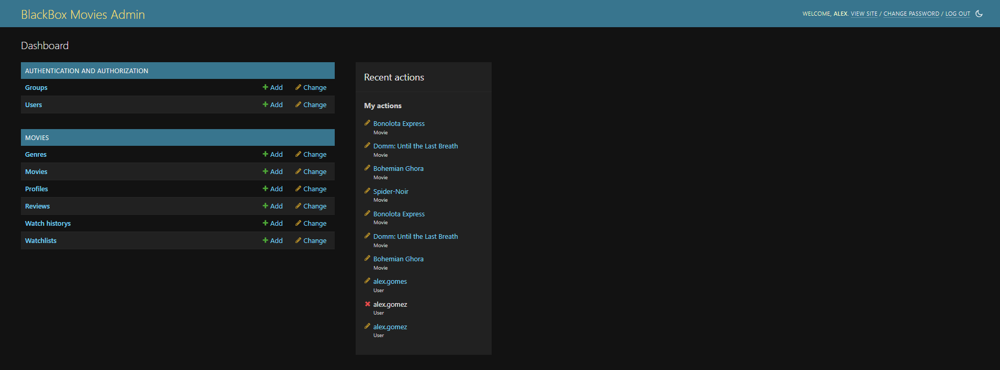
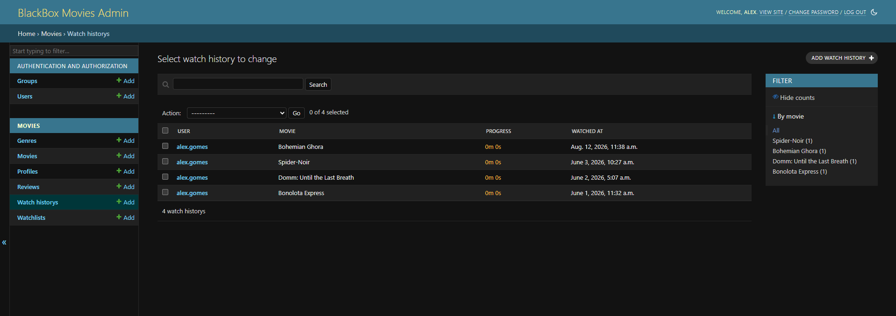

<<<<<<< HEAD
# 🎬 BlackBox Movies

A full-featured Django movie streaming/catalog web application — browse, search, and watch movies by genre, maintain a personal watchlist, leave reviews, and manage everything through a custom admin dashboard.
=======
# BlackBox Movies — Complete Setup Guide
>>>>>>> 0d020fd20ebf7aa8f0da63a02bce7b9cde8f6141


---

## 📖 Table of Contents

- [About](#about)
- [Features](#features)
- [Screenshots](#screenshots)
- [Tech Stack](#tech-stack)
- [Project Structure](#project-structure)
- [Getting Started](#getting-started)
- [Uploading a Movie](#uploading-a-movie)
- [Environment Variables](#environment-variables)
- [Deployment](#deployment)
- [Troubleshooting](#troubleshooting)
- [License](#license)
- [Author](#author)

---

## About

**BlackBox Movies** is a Django-powered movie platform where an admin can upload and manage a full movie catalog — posters, banners, trailers, and video files — while users can browse by genre, search titles, build a personal watchlist, and leave star ratings and reviews.

---

## Features

| Feature | How it works |
|---|---|
| 🎞️ Upload movies | Managed through the Django admin panel |
| 🎭 Browse by genre | `/genre/action/`, `/genre/horror/`, etc. |
| 🔍 Search | `/search/?q=title` or live AJAX search dropdown |
| ▶️ Watch movies | `/watch/movie-slug/` |
| 📌 Watchlist | Login required, toggled via AJAX |
| 👤 User accounts | Register, login, logout |
| ⭐ Reviews & ratings | Star rating system on the movie detail page |
| 🌟 Featured hero | Highlight a movie by setting `is_featured = True` |
| 🔥 Trending row | Highlight a movie by setting `is_trending = True` |

---

## Screenshots

> Add your own screenshots below. Create a `screenshots/` folder in your project root, save your images there, and make sure the filenames match (or update the paths to match your actual filenames).

### 🏠 Homepage


### 🎬 Movie Detail Page


### ▶️ Watch Page


### 🛠️ Admin Dashboard


### 📌 Watchlist


<!--
HOW TO ADD SCREENSHOTS:
1. Create a folder named "screenshots" inside your project root (same level as manage.py)
2. Save your images there — e.g. homepage.png, movie-detail.png, watch-page.png, admin-dashboard.png, watchlist.png
3. Match the filenames above exactly, OR edit the paths above to match your actual filenames
4. git add screenshots/
5. git commit -m "Add project screenshots"
6. git push
GitHub will automatically render these images inline once pushed.
-->

---

## Tech Stack

- **Backend:** Python, Django
- **Database:** SQLite (development) / PostgreSQL (production)
- **Image handling:** Pillow
- **Static files:** Whitenoise
- **WSGI server:** Gunicorn
- **Deployment:** Render.com

---

## Project Structure

```
blackbox/                        ← root project folder
├── blackbox/                    ← Django project config
│   ├── settings.py
│   ├── urls.py
│   └── wsgi.py
├── movies/                      ← main app
│   ├── migrations/
│   ├── templates/movies/
│   │   ├── base.html
│   │   ├── home.html
│   │   ├── card.html
│   │   ├── detail.html
│   │   ├── watch.html
│   │   ├── genre.html
│   │   ├── search.html
│   │   ├── watchlist.html
│   │   ├── profile.html
│   │   ├── login.html
│   │   └── register.html
│   ├── admin.py
│   ├── context_processors.py
│   ├── models.py
│   ├── urls.py
│   └── views.py
├── static/
│   ├── css/main.css
│   └── js/main.js
├── media/                       ← uploaded posters, banners, videos
├── screenshots/                 ← README screenshots
├── requirements.txt
└── manage.py
```

---

## Getting Started

### Prerequisites

- Python 3.10+ (3.12 recommended; 3.14 may cause dependency compatibility issues)
- pip
- Git

### Installation

```bash
# Clone the repository
git clone https://github.com/AlexGomes101/BlackBoxMovies.git
cd BlackBoxMovies

# Create and activate a virtual environment
python -m venv venv
venv\Scripts\activate       # Windows
source venv/bin/activate    # macOS/Linux

# Install dependencies
pip install -r requirements.txt

# Create database tables
python manage.py makemigrations
python manage.py migrate

# Create an admin superuser
python manage.py createsuperuser

# Run the development server
python manage.py runserver
```

Then open:
- **Homepage:** http://127.0.0.1:8000/
- **Admin Panel:** http://127.0.0.1:8000/admin/

---

## Uploading a Movie

1. Go to `http://127.0.0.1:8000/admin/`
2. Log in with your superuser credentials
3. Click **Movies → Add Movie**
4. Fill in title, description, genre, release year, rating, duration
5. Upload a **poster** and optional **banner** image
6. Upload a **video file**, or paste a **Trailer URL** (YouTube embed link, e.g. `https://www.youtube.com/embed/VIDEOID`)
7. Check **Is Featured** to show it in the hero banner, or **Is Trending** to show it in the trending row
8. Click **Save**

---

## Environment Variables

For production, set these instead of hardcoding values in `settings.py`:

| Variable | Description |
|---|---|
| `SECRET_KEY` | Django secret key |
| `DEBUG` | Set to `False` in production |
| `DATABASE_URL` | PostgreSQL connection string (production) |
| `PYTHON_VERSION` | Python version used on the host platform |

---

## Deployment

Configured for free deployment on [Render.com](https://render.com):

- `build.sh` — installs dependencies, collects static files, runs migrations
- `gunicorn` — production WSGI server
- `whitenoise` — serves static files without a separate web server

---

## Troubleshooting

**"No module named 'PIL'"**
```bash
pip install pillow
```

**Images not showing**
Make sure `blackbox/urls.py` includes:
```python
+ static(settings.MEDIA_URL, document_root=settings.MEDIA_ROOT)
```

**Static CSS not loading**
```bash
python manage.py collectstatic
```

**Migration errors**
```bash
python manage.py makemigrations movies
python manage.py migrate
```

---

## License

This project currently has no license specified. Consider adding one (e.g. MIT) if you plan to open-source or share this project publicly.

---

## Author

<<<<<<< HEAD
**Alex Augustine Gomes**
=======
### Railway (free tier):
1. Go to railway.app
2. Connect your GitHub repo
3. Set environment variables:
   - `SECRET_KEY` = your secret key
   - `DEBUG` = False
4. Railway auto-detects Django and deploys

### Render (free tier):
1. Push code to GitHub
2. Go to render.com → New Web Service
3. Add `gunicorn blackbox.wsgi` as start command
4. Add `pip install -r requirements.txt` as build command


Author- Alex Augustine Gomes
=======
# BlackBoxMovies
A Django-based movie management system featuring a structured admin dashboard for adding, editing, and organizing movie records. Built with Python and Django, using Whitenoise for static file handling and Gunicorn for production deployment.
>>>>>>> 0d020fd20ebf7aa8f0da63a02bce7b9cde8f6141
